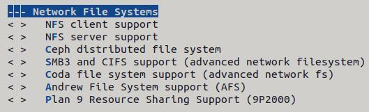
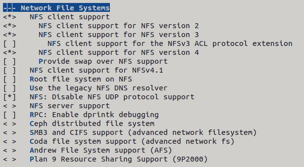
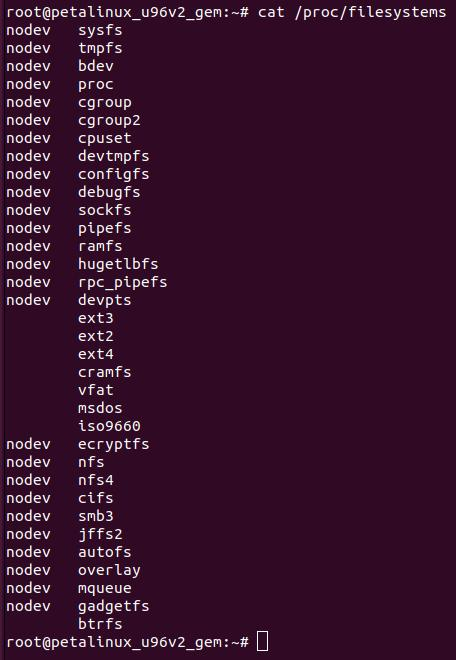
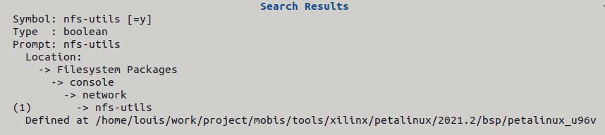
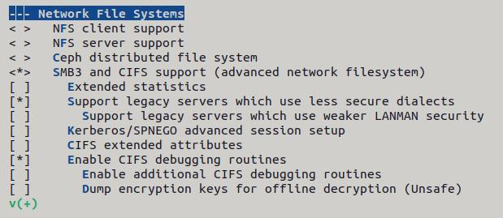
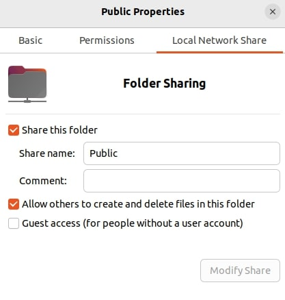
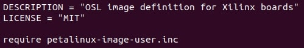
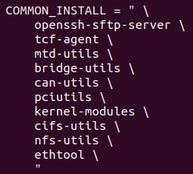

Build
#####

1. Setup Build Environment
**************************
1.1 Docker
==========

1.2 NFS
=======

**【 Host Server 】**

1.2.1 리눅스 커널 설정 변경
----------------------------------------------------

* NFS 파일 시스템을 지원할 수 있도록 리눅스 커널 설정 변경

.. code:: console

    $ petalinux-config -c kernel
    

.. code:: console

    $ petalinux-config -c kernel -x build

1.2.2 NFS 서버 패키지 설치
-----------------------

.. code:: console

    $ sudo apt insall nfs-kernel-server
    $ sudo apt install nfs-common

1.2.3 NFS 서버 환경 설정
---------------------

* 공유 디렉토리 설정

.. code:: console

    $ sudo vim /etc/exports
    
    /nfs *(rw,sync,no_subtree_check,no_root_squash)
    
.. list-table:: Options
    :header-rows: 1
    :widths: 10, 10

    * - Option
      - Description
    * - /nfs
      - 공유 디렉토리 ( 경로 포함 )
    * - IP 
      - 허용 클라이언트 IP 를 지정 ( *: 전체 서브넷 허용 )
    * - rw
      - Stands for read / write ( ro: Read-only file system )
    * - sync
      - Requires changes to be written to the disk beefore the are applied
    * - no_subtree_check
      - Eliminates subtree checking
    * - no_root_squash
      - 클라이언트에게 root 권한 접금을 허용하지 
    
* NFS 서버 재구동

.. code:: console

    $ sudo exportfs -a
    $ sudo exportfs -v    # or showmount -e
    
    /nfs            <world>(sync,wdelay,hide,no_subtree_check,sec=sys,rw,secure,no_root_squash,no_all_squash)
    
    $ service nfs-kernel-server restart    # stop -> start

------

**【 Target Board Client 】**

1.2.4 NFS 파일 시스템 지원 여부 확인
-----------------------------------------------------------------------------------

* ``/proc/filesystems`` 에서 커널이 지원하는 파일 시스템들 중에 ``NFS`` 를 지원하는지 확인

.. code:: console

    $ cat /proc/filesystems

    nodev    nfs
    nodev    nfs4

1.2.5 NFS 클라이언트 패키지 설치
----------------------------

* NFS 디렉토리를 마운트하기 위해 필요한 패키지 설치

.. code:: console

    $ petalinux-config -c rootfs

.. code:: console

    $ petalinux-build -c rootfs -x build

1.2.6 NFS 네트워크 드라이브 연결
----------------------------

* 부팅 후 자동 마운트

.. code:: console

    $ sudo vi /etc/fstab
    
    x.x.x.x:/nfs /mnt/nfs nfs defaults 0 0

1.3 CIFS
========

**【 Host Server 】**

1.3.1 리눅스 커널 설정 변경
-----------------------

* CIFS 파일 시스템을 지원할 수 있도록 리눅스 커널 설정 변경

.. code:: console

    $ petalinux-config -c kernel
    

.. code:: console

    $ petalinux-config -c kernel -x build

1.3.2 CIFS 서버 패키지 설치
------------------------

.. code:: console

    $ sudo apt insall cifs-utils

1.3.3 Samba 계정 생성
-------------------

.. code:: console

    $ sudo smbpasswd -a [ID]

1.3.4 공유 디렉토리 설정
--------------------

------

**【 Target Board Client 】**

1.3.5 CIFS 클라이언트 패키지 설치
----------------------------

* CIFS 디렉토리를 마운트하기 위해 필요한 패키지 설치

.. code:: console

    $ vim ./components/yocto/layers/meta-petalinux/recipes-core/images/petalinux-image-user.bb
    

.. code:: console

    $ vim ./components/yocto/layers/meta-petalinux/recipes-core/images/petalinux-image-user.inc
    
    # 아래 두 패키지 추가
    cifs-utils \
    nfs-utils \

1.2.6 CIFS 네트워크 드라이브 연결
----------------------------

* CLI에서 명령어 입력을 통한 마운트

.. code:: console

    $ mount -t cifs -o user=xxx,password=xxx \\x.x.x.x\cifs /mnt/cifs
    # mount -t cifs -o user=[ID],password=[PASSWORD] \\[IP]\[공유 디렉토리] [마운트 디렉토리]
    
* 부팅 후 자동 마운트

.. code:: console

    $ sudo vi /etc/fstab
    
    //x.x.x.x/Public /mnt/cifs cifs user=xxx,password=xxx,_netdev 0 0

2. Compile
*************
.. code:: console

    $ source ./settings.sh
    $ petalinux-build    # Full build
    
2.1 Bootloader Compile
======================
.. code:: console

    $ petalinux-build -c u-boot -x clean
    $ petalinux-build -c u-boot -x cleansstate
    $ petalinux-build -c u-boot -x mrproper
    $ petalinux-config -c u-boot
    $ petalinux-build -c u-boot -x build
    
2.2 Kernel Compile
==================
.. code:: console

    $ petalinux-build -c kernel -x clean
    $ petalinux-build -c kernel -x cleansstate
    $ petalinux-build -c kernel -x mrproper
    $ petalinux-config -c kernel
    $ petalinux-build -c kernel -x build

3. Create Rootfs
****************
Small rootfs:

.. code:: console

    $ vim ./components/yocto/layers/meta-petalinux/recipes-core/images/petalinux-image-user.bb
    $ vim ./components/yocto/layers/meta-petalinux/recipes-core/images/petalinux-image-user.inc

    $ petalinux-build -c petalinux-image-user -x clean
    $ petalinux-build -c petalinux-image-user -x cleansstate
    $ petalinux-build -c petalinux-image-user -x mrproper
    $ petalinux-build -c petalinux-image-user -x build

Normal rootfs:

.. code:: console

    $ petalinux-build -c rootfs -x clean
    $ petalinux-build -c rootfs -x cleansstate
    $ petalinux-build -c rootfs -x mrproper
    $ petalinux-config -c rootfs
    $ petalinux-build -c rootfs -x build
    
Mount rootfs:

.. code:: console

    $ mkdir rootfs/
    $ sudo mount -t ext4 rootfs.ext4 rootfs/
    $ ls rootfs/
    $ sudo umount rootfs/

4. Create Boot Images
****************
.. code:: console

    $ cd ./petalinux_u96v2/bsp/images/linux
    $ petalinux-package --boot --fsbl zynqmp_fsbl.elf --fpga system.bit --pmufw pmufw.elf --u-boot --force

5. Flash Images
***************
.. code:: console

    $ cd ./petalinux_u96v2/bsp/images/linux

5.1 INITRAMFS
=============
* RAM-based File System ( INITRAMFS, JTAG )

#. Petalinux Configuration for INITRAMFS

    .. code-block:: console

        $ petalinux-config

    .. image:: images/initramfs_0.png
    |
    .. image:: images/initramfs_1.png
|
    
    #. Create RootFS

        .. code-block:: console

            $ petalinux-build -c petalinux-image-user -x build            
            $ mkdir initramfs            
            $ tar -xf rootfs.tar.gz -C initramfs            
            or            
            $ sudo mount -t ext4 rootfs.ext4 initramfs

#. Kernel Configuration for INITRAMFS

    .. code-block:: console

        $ petalinux-config -c kernel

    .. image:: images/initramfs_3.png
    .. image:: images/initramfs_4.png
    .. image:: images/initramfs_5.png
    |

    #. Modify boot argument
    
        .. code-block:: console
        
            $ vim ./project-spec/meta-user/recipes-bsp/device-tree/files/system-user.dtsi
            
        .. note::
            Modify 'chosen' node.            
            
            ``bootargs = "earlycon console=ttyPS0,115200 clk_ignore_unused root=/dev/ram0 rw rootwait quiet``
        
    #. Apply the modification to DTB and Create linux kernel image included RooFS
            
        .. code-block:: console
        
            $ petalinux-build -c kernel -x build
            
        .. note::
            chosen 노드 수정 사항이 제대로 적용되었는지 DTB을 DTS로 변환하여 확인해본다.
            
            ``$ dtc -I dtb -O dts -f system.dtb -o system.dts``
            
#. Create BOOT.BIN
    
    .. code-block:: console

        $ petalinux-package --boot --fsbl zynqmp_fsbl.elf --fpga design_1_wrapper.bit --pmufw pmufw.elf --u-boot --force

#. JTAG Downloads

    .. code-block:: console
    
        $ petalinux-boot --jtag --u-boot --fpga --bitstream design_1_wrapper.bit --pmufw pmufw.elf
        $ petalinux-boot --jtag --kernel --fpga --bitstream design_1_wrapper.bit --pmufw pmufw.elf
        
    .. image:: images/initramfs_6.png
    | 
    
    .. code-block:: console
    
        $ df -h
    
    .. image:: images/initramfs_7.png
    | 
    
    .. note::
        PMUFW / FSBL은 bitstream의 XSA ( Export Hardware )로 생성한 Vitis IDE 'Platform project'에서 빌드한 이미지를 사용한다.
        
    .. warning::
        ``--u-boot`` 옵션은 u-boot CLI에서 빠르게 작업을 진행하기 위해 linux kernel 이미지와 RooFS를 메모리에 적재하지 않는다.

5.2 eMMC
========
* Flash-based File System ( eMMC, JTAG )

#. Petalinux Configuration for Ext4 File System

    .. code-block:: console

        $ petalinux-config

    .. image:: images/emmc_0.png    
    .. image:: images/emmc_1.png    
    .. image:: 

    .. code-block:: console

        $ petalinux-build -c petalinux-image-user -x build
    
#. Kernel Configuration for Ext4 File System

    .. code-block:: console

        $ petalinux-config -c kernel

    .. image:: images/emmc_2.png    
    .. image:: images/emmc_3.png    
    .. image:: 

    #. Modify boot argument
    
        .. code-block:: console
        
            $ vim ./project-spec/meta-user/recipes-bsp/device-tree/files/system-user.dtsi
            
        .. note::
            Modify 'chosen' node.            
            
            ``bootargs = "earlycon console=ttyPS0,115200 clk_ignore_unused root=/dev/mmcblk0p2 rw rootwait quiet``
        
    #. Apply the modification to DTB and Create linux kernel image included RooFS
            
        .. code-block:: console
        
            $ petalinux-build -c kernel -x build
            
        .. note::
            chosen 노드 수정 사항이 제대로 적용되었는지 DTB을 DTS로 변환하여 확인해본다.
            
            ``$ dtc -I dtb -O dts -f system.dtb -o system.dts``
            
#. Create BOOT.BIN
    
    .. code-block:: console

        $ petalinux-package --boot --fsbl zynqmp_fsbl.elf --fpga design_1_wrapper.bit --pmufw pmufw.elf --u-boot --force

5.2 SD Card
===========
Partition:

.. code:: console

    $ sudo fdisk /dev/sdx
    $ sudo fdisk -l
    
    Device     Boot   Start      End  Sectors  Size Id Type
    /dev/sdx1          2048  2099199  2097152    1G  c W95 FAT32 (LBA)
    /dev/sdx2       2099200 31205375 29106176 13.9G 83 Linux

Format:

.. code:: console

    $ sudo mkfs -t ext4 /dev/sdx2

Specify mount directory:

.. code:: console

    $ sudo vim /etc/fstab
    
    UUID=5AA3-7D75 /media/louis/SD_BOOT vfat defaults 0 0
    UUID=2749244d-79ab-4493-87b1-2dace4105cbb /media/louis/SD_ROOTFS ext4 defaults 0 0

Insert SD Card and Check mount info:

.. code:: console

    $ dmesg | tail
    $ mount
    
Write boot images ``BOOT.BIN`` ``image.ub`` ``boot.scr`` to BOOT partition:

.. code:: console

    $ sudo cp BOOT.BIN image.ub boot.scr /media/louis/SD_BOOT

Write rootfs images ``rootfs.ext4`` to ROOTFS partition:

.. code:: console

    $ sudo dd if=rootfs.ext4 of=/dev/sdx2
    or
    $ make rootfs/
    $ mount -t ext4 rootfs.ext4 rootfs/
    $ sudo cp -rf rootfs/* /media/louis/SD_ROOTFS
    $ sync

5.4 NFS
=======
Host:

.. code:: console

    $ sudo cp BOOT.BIN boot.scr image.ub /mnt/shared/images/u96v2-v2021.2-images/linux/
    $ sudo cp rootfs.ext4 /mnt/shared/images/u96v2-v2021.2-images/linux/

Target Board:

.. code:: console

    $ ifconfig eth0 up x.x.x.x or ifup eth0 ( /etc/network/interface )
    $ cp /mnt/cifs/images/u96v2-v2021.2-images/linux/BOOT.BIN
    $ cp /mnt/cifs/images/u96v2-v2021.2-images/linux/image.ub
    $ reboot
